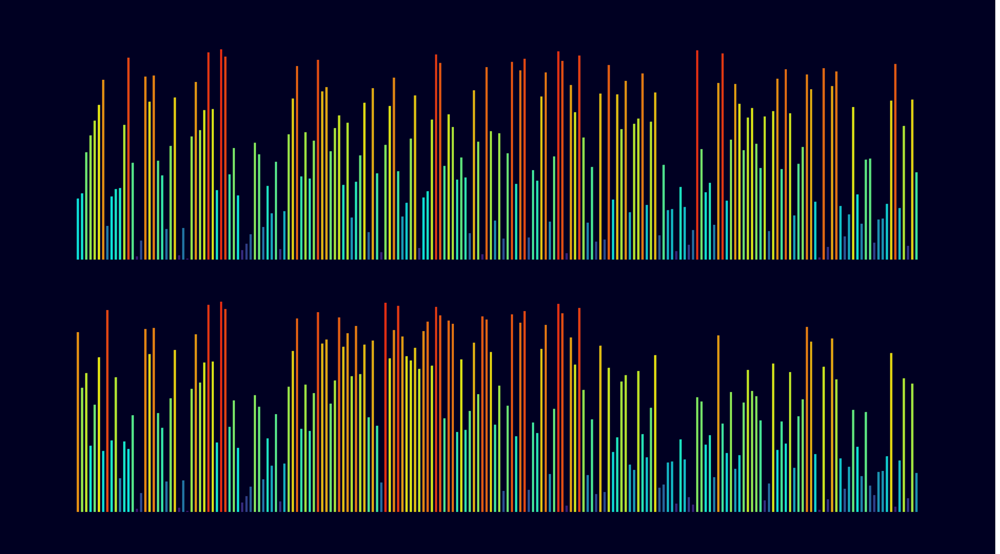

# HeapSort vs MergeSort - Visualização na Unity 🎮📊

Este projeto foi desenvolvido com o objetivo de **visualizar e comparar em tempo real os algoritmos de ordenação HeapSort e MergeSort**. Utilizando a engine **Unity**, criei uma cena interativa onde ambos os algoritmos executam o processo de ordenação lado a lado, permitindo observar como cada um opera sobre os mesmos dados.

---

## 📸 Imagens

### 🔹 Início da ordenação



### 🔹 Meio do processo (sorting em andamento)


---

## 🎯 Objetivo

- Demonstrar as diferenças visuais e conceituais entre os algoritmos **HeapSort** e **MergeSort**.
- Auxiliar no aprendizado de estruturas de dados e algoritmos através de uma abordagem interativa e dinâmica.
- Comparar o desempenho e o comportamento dos algoritmos em tempo real.

---

## 🛠️ Tecnologias Utilizadas

- [Unity](https://unity.com/) (versão utilizada: *insira a versão aqui*)
- C# (lógica dos algoritmos)
- Visual Studio (IDE para desenvolvimento)

---

## 📹 Como Funciona

- O usuário inicia a cena com um array de barras representando números inteiros.
- Duas áreas são exibidas na tela: uma para o **HeapSort** e outra para o **MergeSort**.
- As barras são ordenadas em tempo real por cada algoritmo, com animações passo a passo.
- É possível observar como o HeapSort utiliza uma estrutura de heap e como o MergeSort realiza divisões recursivas e fusões.

---

## 🧠 Algoritmos Implementados

### HeapSort
- Utiliza uma **estrutura de heap máxima** para ordenar os elementos.
- Complexidade: `O(n log n)`
- Ordenação **in-place** (não usa memória extra significativa).

### MergeSort
- Segue o paradigma de **divisão e conquista**.
- Complexidade: `O(n log n)`
- Utiliza **memória auxiliar** para combinar os arrays divididos.

---

## 🔧 Como Rodar o Projeto

1. Clone este repositório:
   ```bash
   git clone https://github.com/seu-usuario/seu-repositorio.git
